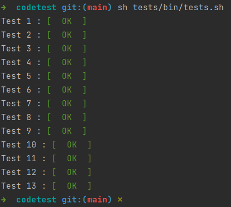

# Módulo de objetivos (droide YVH)

A continuación añado una breve documentación acerca de los aspectos
más importantes de este módulo de objetivos diseñado para el droide
de combate YVH.

## Puesta en marcha

### Requisitos

Será necesario disponer de `docker-compose` en el equipo en el que
se ejecute este módulo.

### Arrancando el sistema

Para hacer uso del módulo será necesario ejecutar el siguiente comando:

```
sh bin/deploy
```

Se ejecutarán los test unitarios del propio módulo. Una vez terminados,
será el turno de las librerías de detección de errores y corrección de
estilos. Finalmente, arrancará el contenedor con el servidor web que
atenderá las peticiones que han de llegar al módulo, en el siguiente
dominio:

```
http://localhost:8888
```

### Comprobando los test de la Nueva República

Una vez arrancado el sistema, los test proporcionados por la Nueva República se
han ubicado en la carpeta `tests` del proyecto, y para su ejecución será
necesario el siguiente comando:

```
sh tests/bin/tests.sh
```

El resultado debería ser algo similar a lo siguiente:



**IMPORTANTE** - He tenido que modificar el script para cambiar el `==` que comprueba
que el resultado obtenido es igual que el esperado, por simplemente `=`. Entiendo que
es una peculiaridad del bash de Ubuntu, y si se ejecutara localmente en otro sistema
operativo, quizás sea necesario restablecer el script.

## Documentación

* [Estructura de directorios](./doc/filesystem.md)
* [Modelo de datos](./doc/entities.md)
* [Inclusión de nuevos protocolos](./doc/new-protocols.md)
* [Complejidades](./doc/complexity.md)
* [Librerías utilizadas](./doc/libraries.md)
* [Requisitos originales](./doc/requirements.pdf)
