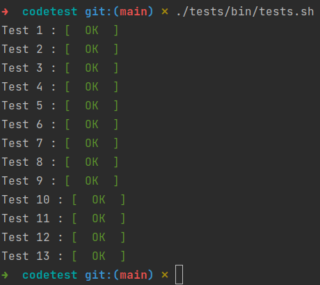

# Módulo de objetivos (droide YVH)

A continuación añado una breve documentación acerca de los aspectos
más importantes de este módulo de objetivos diseñado para el droide
de combate YVH.

## Puesta en marcha

### Requisitos

Será necesario disponer de `docker-compose` en el equipo en el que
se ejecute este módulo.

### Arrancando el sistema

Para hacer uso del módulo será necesario ejecutar el siguiente comando:

```
sh bin/deploy
```

Este comando arrancará el contenedor con el servidor web que atenderá
las peticiones que han de llegar al módulo, en el siguiente dominio:

```
http://localhost:8888
```

Una vez arrancado, el script continuará ejecutando los test unitarios
del propio módulo. Posteriormente, será el turno de las librerías de
detección de errores y corrección de estilos. Finalmente,se pasarán
los tests proporcionados por la Nueva República.

### Comprobando los test de la Nueva República

Los test proporcionados por la Nueva República se han ubicado en la
carpeta `tests` del proyecto, y para su ejecución será necesario el
siguiente comando:

```
./tests/bin/tests.sh
```

El resultado debería ser algo similar a lo siguiente:



## Documentación

* [Estructura de directorios](./doc/filesystem.md)
* [Modelo de datos](./doc/entities.md)
* [Inclusión de nuevos protocolos](./doc/new-protocols.md)
* [Complejidades](./doc/complexity.md)
* [Librerías utilizadas](./doc/libraries.md)
* [Requisitos originales](./doc/requirements.pdf)
