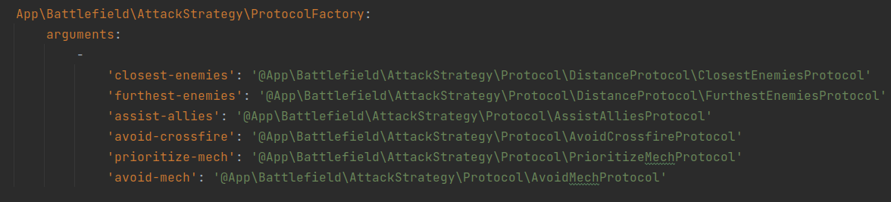

# Inclusión de nuevos protocolos

Para la aplicación de protocolos se ha utilizado el patrón `StrategyPattern`,
por lo que simplemente será necesario que el protocolo implemente la interfaz
`Protocol`.

Esta interfaz cuenta con los siguientes métodos:

* **prioritizeTargets** - Recibe una lista de protocolos y devuelve aquellos elementos
que cumplen con los criterios del protocolo.

* **getIncompatibleProtocols** - Devuelve una colección con los nombres de clase de los
protocolos incompatibles con el actual, como podrían ser `closest-enemies` y
`furthest-enemies`, de manera que se pueda alertar al cliente en caso de que intente aplicar
protocolos incompatibles.

* **isDependent** - Recibe un protocolo e informa si el protocolo actual es dependiente de 
él o no. Se utiliza para aplicar los protocolos por un orden de prioridades, como se explica
en el [modelo de clases](./entities.md).

Una vez implementados correctamente los métodos de la interfaz, sólo hará falta
añadirlo a la colección de servicios que recibe la clase `ProtocolFactory`, encargada
de devolver la instancia del servicio correspondiente en función del nombre con el que
se ha mapeado.

Esta colección se encuentra en el fichero config/services.yaml.

